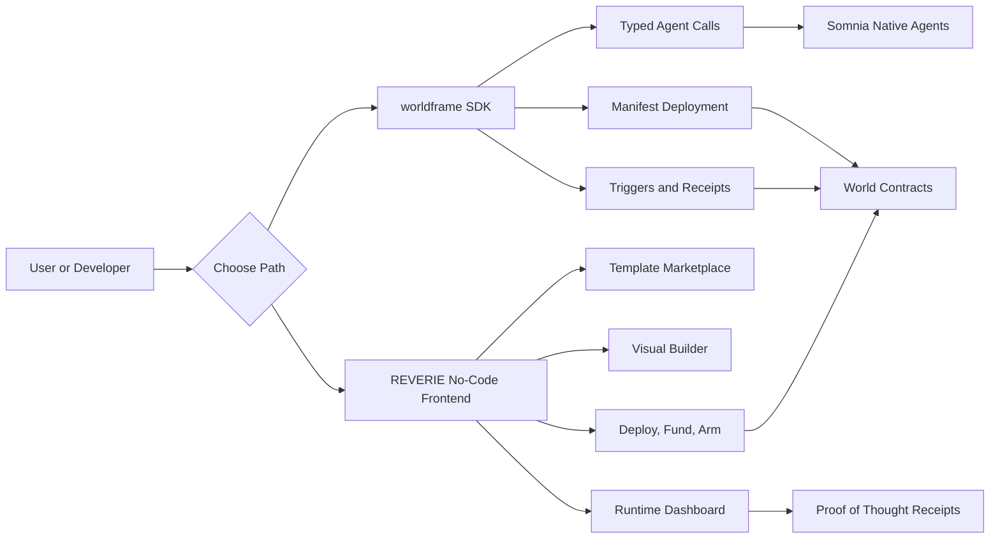
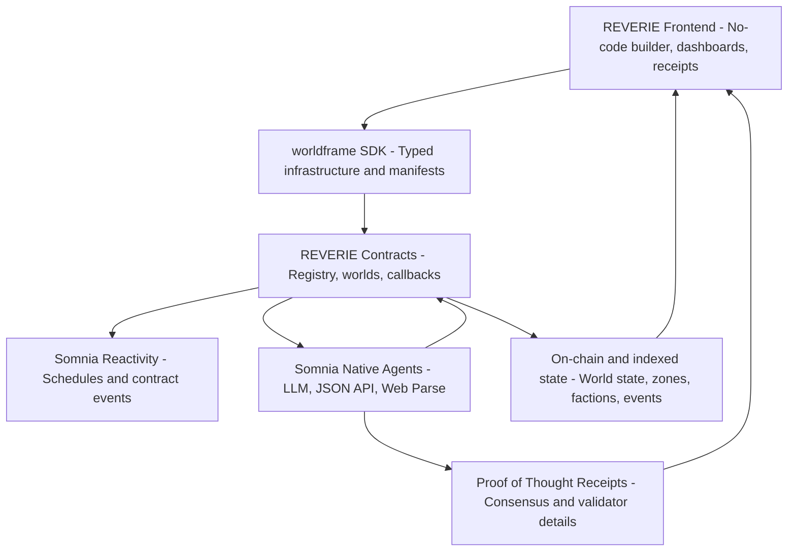
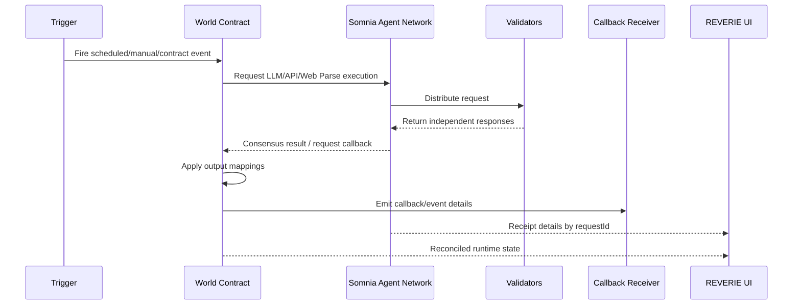
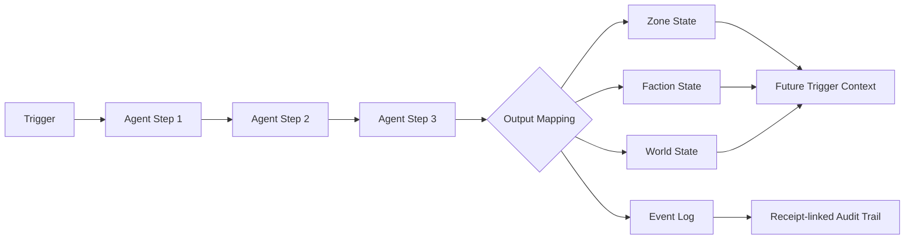
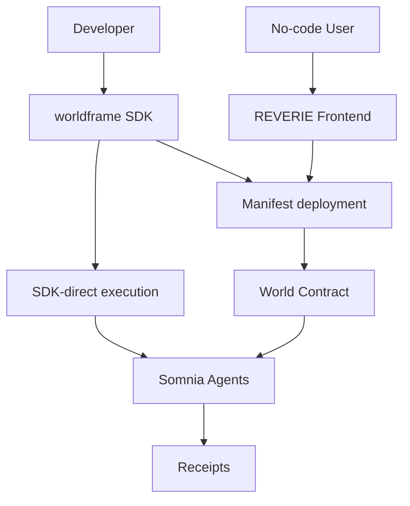
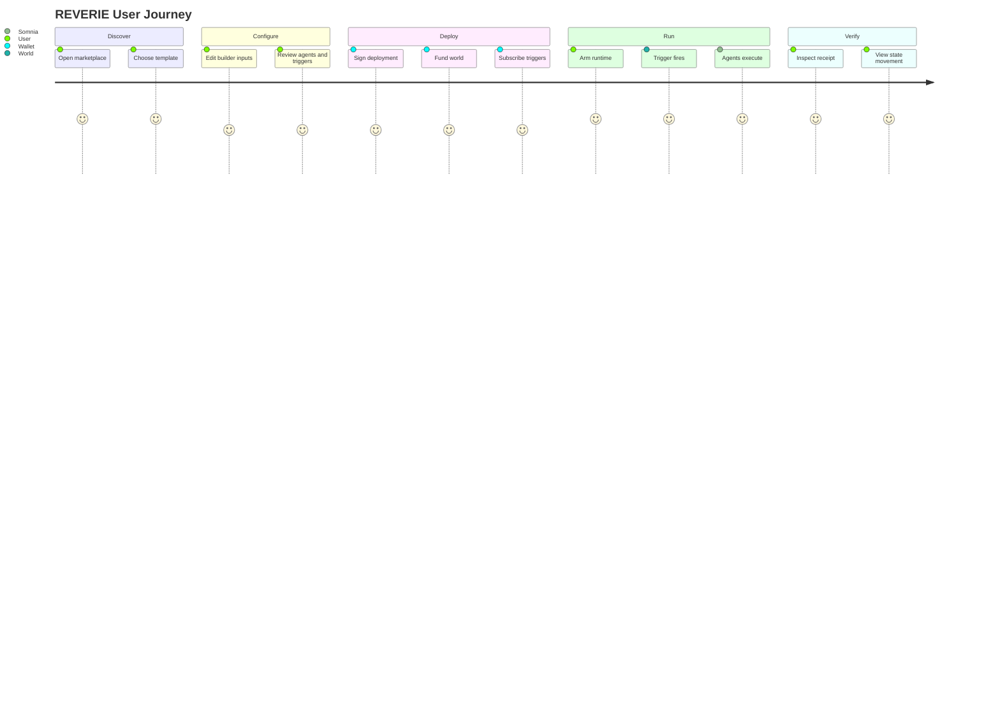
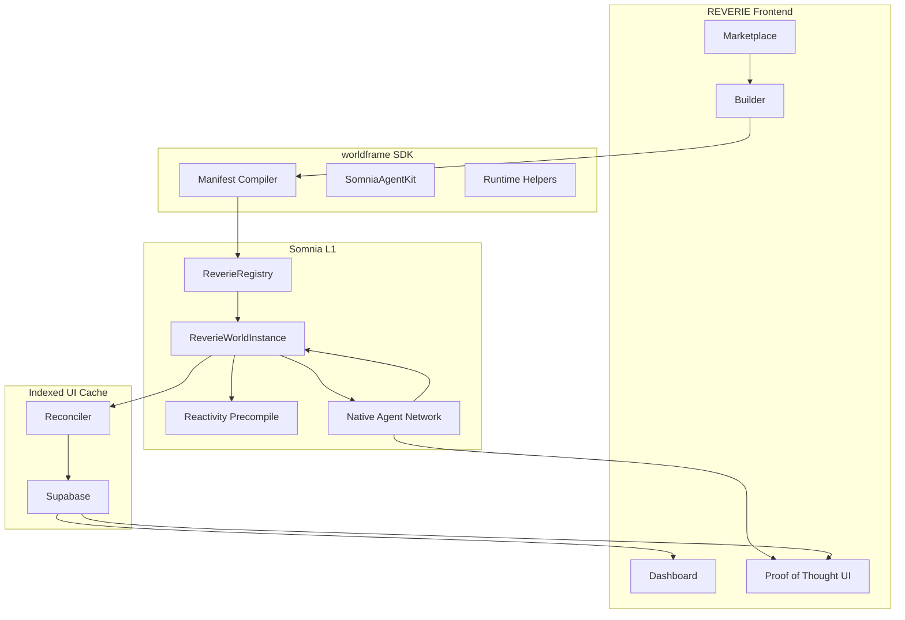

# REVERIE Presentation Deck

## The Operating System for Autonomous On-Chain Intelligence

> REVERIE is the intelligence and infrastructure layer for autonomous on-chain systems. It makes it possible to run reactive, AI-powered logic on Somnia's L1 with consensus-verified decisions, auditable receipts, and no centralized backend.

**One-line thesis:** REVERIE turns smart contracts from passive programs into self-sustaining, AI-powered systems that can sense, reason, act, and prove what happened.

---

## Slide 1: What Is REVERIE?

REVERIE is a full-stack platform for building autonomous systems on-chain.

It is not only a virtual-world builder. It is an operating system for any application that needs:

- Real-world data
- Reactive triggers
- AI reasoning
- On-chain state changes
- Consensus verification
- Auditable execution receipts
- Long-running autonomous behavior

REVERIE has two deliverables:

1. **`@worldframe/sdk`**: The developer infrastructure layer for Somnia native agents, REVERIE agents, manifests, triggers, receipts, and wallet-safe execution.
2. **REVERIE frontend**: A no-code platform where anyone can configure, deploy, fund, monitor, and update autonomous on-chain systems without writing smart contracts.

---

## Slide 2: The Core Problem

Today, every "intelligent" blockchain application has the same architectural flaw:

> The assets may live on-chain, but the intelligence lives off-chain.

| Application type | Where intelligence usually runs | Trust issue |
|---|---|---|
| Virtual worlds | Game servers | NPC/world logic is controlled by the game operator |
| DeFi automation | Centralized bots | Users trust private bot infrastructure |
| AI experiences | LLM provider servers | No on-chain proof of reasoning |
| Reactive systems | External keepers/watchers | Trigger execution depends on third parties |
| Data-driven apps | Centralized APIs/oracles | Data extraction and interpretation are opaque |

The consequence is simple: users trust server logs instead of cryptographic consensus.

---

## Slide 3: Why Off-Chain Intelligence Is a Problem

Blockchains solve trust for assets, transactions, and settlement. But most "smart" applications still depend on private infrastructure for:

- AI decisions
- Data fetching
- Event monitoring
- Trigger scheduling
- Business logic
- World-state updates
- Automated execution

That creates a trust gap.

```text
On-chain token balance:      Verifiable
On-chain transfer:           Verifiable
AI decision behind action:   Usually not verifiable
Data used by the AI:         Usually not verifiable
Trigger that caused action:  Usually not verifiable
```

REVERIE closes that gap by moving intelligence and reactivity into a Somnia-native execution flow.

---

## Slide 4: The REVERIE Solution

REVERIE lets developers and non-technical users run AI-powered, reactive logic without managing centralized infrastructure.

The difference:

```text
AWS Lambda runs in Amazon's data centers.
REVERIE runs through Somnia's L1 agent and contract flow.
```

Once deployed and funded, a REVERIE system can:

1. React to real-world data
2. Run agent workflows
3. Make consensus-verified decisions
4. Update on-chain state
5. Emit receipts and event logs
6. Continue operating without human intervention

---

## Slide 5: Product Overview



REVERIE is both:

- **Infrastructure** for builders who want direct TypeScript access.
- **A product** for users who want an interface instead of code.

---

## Slide 6: Two Deliverables

### 1. `@worldframe/sdk`

The SDK is the infrastructure layer.

It gives developers:

- Direct access to Somnia native agents
- Type-safe execution helpers
- Manifest compilation
- World deployment helpers
- Trigger and Reactivity support
- Receipt handling
- Browser wallet and server execution paths

### 2. REVERIE Frontend

The frontend is the no-code operating surface.

It gives users:

- A visual autonomous-system builder
- Official templates
- Agent creation and testing
- Data-source configuration
- Trigger deployment
- Wallet-signed live deployment
- Proof-of-Thought receipt viewing
- Runtime dashboards and event streams

---

## Slide 7: What Somnia Makes Possible

REVERIE is built around Somnia's native L1 agent architecture.

Somnia provides the foundation for:

- Native LLM execution
- Native JSON API requests
- Native webpage parsing
- Validator-backed agent responses
- Request IDs and execution receipts
- Reactivity subscriptions
- Fast testnet execution for autonomous workflows

REVERIE turns those primitives into a complete developer and consumer platform.

---

## Slide 8: The Intelligence Stack



The frontend is not the source of truth for autonomous execution. It is the configuration and monitoring layer. The live system runs through contracts, Somnia agents, callbacks, and receipts.

---

## Slide 9: How a Decision Happens



The key difference is that the decision is not just a private API response. It is attached to validator consensus, an on-chain request, and a receipt trail.

---

## Slide 10: Proof of Thought

Proof of Thought is the audit trail for AI execution.

It answers:

- What did the system ask the agent to do?
- What data did the agent receive?
- Which validators participated?
- Did validators agree?
- What was the final consensus result?
- Did the callback succeed?
- How much execution budget was used?
- What state changed afterward?

This matters because AI decisions become inspectable instead of opaque.

```text
Without receipts:
  "The AI said this happened. Trust us."

With Proof of Thought:
  "Here is the request, validator result, consensus status, callback, and state effect."
```

---

## Slide 11: Agent System

REVERIE exposes seven agent capabilities.

### Somnia Native Agents

| Agent | Purpose | Example |
|---|---|---|
| LLM Inference | Reasoning and decision-making | "Should this route continue?" |
| JSON API Request | Fetch and extract public API values | Weather code, price, score |
| Web Parse | Extract structured information from webpages | News, site content, reports |

### REVERIE Agents

| Agent | Purpose | Example |
|---|---|---|
| Chronicle | Write event history | "Record what happened" |
| Zone Climate | Interpret local state | Weather/risk for a zone |
| Faction Morale | Update actor sentiment | Morale after an event |
| Conflict Resolution | Resolve disputes | Choose outcome between parties |

These agents can be composed into multi-step workflows.

---

## Slide 12: Trigger-to-Agent-to-State Loop



This loop is what makes a REVERIE system autonomous.

Each execution updates the context that future executions can read.

---

## Slide 13: The Autonomous System Model

REVERIE uses "world" language, but the model is broader than games.

| REVERIE concept | Generic meaning |
|---|---|
| World | Autonomous system or application |
| Zone | Region, market, asset, route, pool, jurisdiction, module |
| Faction | Stakeholder, strategy, DAO group, operator, risk actor |
| Trigger | Condition that starts execution |
| Agent chain | Reasoning or data workflow |
| World state | Persistent system memory |
| Event | Audit log, not primary state |
| Output mapping | Where agent results are applied |

That means REVERIE can model a fantasy kingdom, a cargo route, a DAO, an insurance process, or a DeFi risk engine with the same runtime primitives.

---

## Slide 14: What the No-Code Builder Does

The REVERIE frontend lets a user configure an autonomous system visually.

Core builder surfaces:

- Runtime identity
- Inputs
- Data sources
- Agents and tools
- Zones
- Factions
- Triggers
- Output mappings
- Relationships
- Manifest preview
- Live URL/data-source resolution

The builder compiles this configuration into a deterministic manifest.

```text
Builder config -> compileWorldManifest() -> wallet-signed deployment -> live world runtime
```

---

## Slide 15: Manifest-Driven Runtime

The manifest is the contract-readable plan for the world.

It contains:

- Zones
- Factions
- Triggers
- Agent steps
- Relationships
- Output mappings
- Schedule metadata
- Decision continuation rules
- Manifest hash

The manifest matters because it makes the runtime deterministic. The user can inspect what will run before signing deployment.

---

## Slide 16: Execution Lanes

REVERIE supports two execution lanes.

| Lane | Who uses it | What it is for |
|---|---|---|
| SDK lane | Developers and tests | Direct TypeScript calls to agents and worlds |
| On-chain lane | Live deployed worlds | Contract-owned workflows, callbacks, reactivity, and state effects |

The same agent concepts can be used in both lanes.



---

## Slide 17: Reactivity

Autonomy needs triggers. REVERIE supports several trigger types.

| Trigger type | What it does |
|---|---|
| Manual action | Owner starts a workflow from the UI |
| Scheduled | Runs on fixed cron-like intervals |
| Contract event | Reacts to an on-chain event |
| Data condition | Reacts when external data meets a condition |

Scheduled and contract-event triggers are designed for autonomous operation through Somnia Reactivity. Manual triggers are useful for testing and owner-approved actions.

---

## Slide 18: Runtime Lifecycle

```mermaid
flowchart LR
  A["Choose Template"] --> B["Configure Builder"]
  B --> C["Publish"]
  C --> D["Deploy World Contract"]
  D --> E["Configure Manifest"]
  E --> F["Fund World"]
  F --> G["Subscribe Required Triggers"]
  G --> H["Arm Runtime"]
  H --> I["Autonomous Execution"]
  I --> J["Receipts and Reconciliation"]
  J --> K["State Movement in UI"]
```



Once armed, the world can keep running as long as it has funds and live triggers.

---

## Slide 19: Official Templates

Templates are starter autonomous systems. They are not just demos; they are blueprints for live workflows.

| Template | Autonomous system it demonstrates |
|---|---|
| Cargo Climate Guard | Supply-chain route planning, weather checks, rerouting, voyage state |
| Global Climate Crisis Response | Fixed public weather feeds, regional crisis assessment, response readiness |
| Crypto Market Intelligence | Market data, risk analysis, strategy/faction confidence |
| Sports Prediction League | Match data, prediction locking, settlement, morale updates |
| Living Kingdom Lite | Game-world events, faction morale, narrative state |

Templates let users see the complete loop: data source -> trigger -> agents -> state effects -> receipts.

---

## Slide 20: Example - Cargo Climate Guard

Cargo Climate Guard models a shipping route as an autonomous system.

The user enters:

- Start port
- Destination port
- Speed

The system can:

1. Resolve a route graph
2. Project cargo position
3. Fetch weather for the projected location
4. Evaluate safety
5. Decide continue, reroute, wait, arrived, or stop
6. Record voyage state
7. Schedule the next tick

This demonstrates how supply-chain logic can become autonomous and verifiable.

---

## Slide 21: Example - Global Climate Crisis Response

Global Climate Crisis Response models a multi-region crisis-monitoring network.

The system uses fixed public weather feeds for:

- Americas
- Europe
- Asia-Pacific
- Africa / Middle East

Then it:

1. Reads weather data
2. Assesses severity
3. Updates regional zones
4. Updates readiness of agencies/factions
5. Writes a Chronicle entry
6. Records receipt-backed crisis movement

This demonstrates insurance, public-sector, and emergency-response workflows.

---

## Slide 22: Use Cases

REVERIE is useful anywhere intelligence and reactivity create value.

| Category | Example autonomous system |
|---|---|
| DeFi automation | Risk-aware strategy engine that reacts to price volatility |
| Gaming | Living worlds with autonomous factions and story progression |
| Social tokens | Community mechanics that react to activity and events |
| AI NFTs | NFTs that evolve based on verified external signals |
| DAOs | Governance workflows with agent-assisted analysis |
| Prediction markets | Data-based settlement and confidence scoring |
| Insurance | Parametric claims and crisis-response monitoring |
| Supply chain | Route, weather, and logistics decision engines |
| Virtual worlds | Persistent world state with verifiable NPC decisions |

---

## Slide 23: Why REVERIE Is Different

REVERIE is not just another AI wrapper.

| Traditional AI app | REVERIE |
|---|---|
| AI runs on a private server | AI runs through Somnia native agents |
| Output is trusted by convention | Output is backed by receipt and consensus |
| Triggers run in hosted cron jobs | Triggers can run through on-chain reactivity |
| State lives in app databases | Critical runtime state is contract-driven and reconciled |
| Users rely on admin servers | Users deploy wallet-owned systems |
| Developers build backend glue | Developers use SDK and manifests |

---

## Slide 24: The Technical Moat

REVERIE combines several hard pieces into one platform:

- Somnia native agent integration
- Consensus-aware receipt handling
- Manifest compiler
- Wallet-safe SDK execution
- Contract-owned runtime flow
- Reactivity subscription support
- Runtime reconciliation
- No-code builder
- Template marketplace
- Multi-agent chain execution
- State-effect mapping

The moat is not one feature. It is the complete operating system around autonomous on-chain intelligence.

---

## Slide 25: What Developers Get

With `@worldframe/sdk`, developers can:

- Execute LLM, JSON API, and Web Parse requests
- Use REVERIE custom agents
- Compile world manifests
- Deploy world contracts
- Configure triggers
- Fund and arm worlds
- Read receipts
- Reconcile state
- Build custom applications on top of Somnia agents

Example developer mindset:

```text
"I do not want to build custom AI oracle infrastructure.
I want a typed SDK that lets my contract or app request consensus-verified intelligence."
```

---

## Slide 26: What Non-Developers Get

With the frontend, non-developers can:

- Pick a template
- Edit inputs and labels
- Configure triggers
- Connect data feeds
- Deploy with a wallet
- Fund the world
- Arm the runtime
- Watch live execution
- Open Proof-of-Thought receipts

Example user mindset:

```text
"I want an autonomous system, but I do not want to write Solidity or run servers."
```

---

## Slide 27: Demo Flow

A live demo can show the full product in a few minutes.

1. Open marketplace
2. Choose an official template
3. Create a world
4. Review builder configuration
5. Deploy the world contract
6. Fund the world
7. Subscribe required triggers
8. Apply and arm runtime
9. Fire manual action or wait for schedule
10. Watch event stream
11. Open Proof-of-Thought receipt
12. View state changes

The demo proves the platform is not a mockup. It executes a live agent workflow.

---

## Slide 28: User Journey



---

## Slide 29: Architecture Detail



---

## Slide 30: Data and State Model

The REVERIE state model separates "what happened" from "what changed."

| Layer | Purpose |
|---|---|
| Trigger payload | Context that starts an execution |
| Agent output | Decision or extracted data |
| Zone effect | Local state change |
| Faction effect | Actor/stakeholder state change |
| World state | Persistent system memory |
| Event log | Audit narrative linked to receipts |
| Receipt | Consensus proof of the agent execution |

Events are logs. State effects are the system memory.

That distinction matters because an autonomous system needs both auditability and durable state.

---

## Slide 31: Funding and Economics

Autonomous execution needs gas and agent budget.

REVERIE handles this by:

- Requiring deployed worlds to be funded
- Estimating minimum runtime balance
- Overfunding agent calls where needed
- Relying on unused Somnia execution budget refunds
- Showing funding warnings in the UI
- Reconciling balances after execution

The goal is to prevent agent failures caused by insufficient budget while keeping unused execution funds recoverable.

---

## Slide 32: Security and Trust Assumptions

REVERIE reduces reliance on centralized application servers, but it is still explicit about trust boundaries.

| Component | Trust role |
|---|---|
| Somnia L1 | Settlement, contracts, native agent consensus |
| User wallet | Signs deployment, funding, and runtime actions |
| World contract | Owns live runtime behavior |
| Agent receipts | Prove agent execution details |
| Supabase | Indexed UI cache, not consensus source |
| Frontend | Configuration and monitoring surface |

The critical runtime path is designed around wallet signatures, contracts, native agents, and receipts.

---

## Slide 33: Why This Matters for Somnia

REVERIE is a showcase of Somnia's unique architecture.

It demonstrates that Somnia can support:

- Native AI execution
- Reactive on-chain workflows
- High-frequency autonomous systems
- Contract-owned agent requests
- Real-time user-facing applications
- Proof-carrying AI decisions

REVERIE turns Somnia's agent infrastructure into a builder platform.

---

## Slide 34: Market Positioning

REVERIE sits at the intersection of:

- AI agents
- On-chain automation
- No-code infrastructure
- Autonomous systems
- Verifiable computation
- Real-world data feeds
- Smart contract UX

It is not competing with ordinary dashboards or chatbot wrappers. It is creating a new category: verifiable autonomous intelligence for on-chain systems.

---

## Slide 35: Roadmap

Near-term expansion:

- More official templates
- More robust state-effect visualizations
- Better decision continuation tooling
- Expanded receipt analytics
- Mainnet readiness
- Richer SDK examples
- More trigger types
- More autonomous DeFi and insurance flows
- Community template marketplace

Long-term vision:

> Any user should be able to deploy a self-sustaining on-chain system that senses, reasons, acts, and proves every decision.

---

## Slide 36: Closing Thesis

Autonomous systems need verifiable intelligence.

Today, the intelligence layer of blockchain applications still lives on centralized servers.

REVERIE changes that.

It gives developers infrastructure and gives users a no-code product for deploying AI-powered, reactive, consensus-verified systems on Somnia.

```text
Smart contracts made ownership programmable.
REVERIE makes autonomous intelligence programmable.
```

---

## Appendix A: Simple One-Minute Pitch

REVERIE is the operating system for autonomous on-chain intelligence.

Today, most "intelligent" blockchain applications still run their AI, triggers, and real-world data logic on private servers. That means users trust server logs instead of cryptographic consensus.

REVERIE moves that logic into Somnia's native L1 agent and contract flow. Developers can use `@worldframe/sdk` to access Somnia agents, compile manifests, deploy worlds, configure triggers, and inspect receipts. Non-technical users can use the REVERIE frontend to create autonomous systems from templates, connect data feeds, deploy with a wallet, fund the system, and monitor Proof-of-Thought receipts.

The result is a new kind of on-chain entity: one that can react to the world, make consensus-verified decisions, update its own state, and prove every step.

---

## Appendix B: Technical One-Minute Pitch

REVERIE is a full-stack runtime for Somnia native agents.

At the infrastructure layer, `@worldframe/sdk` wraps Somnia LLM, JSON API, and Web Parse agents with typed execution, manifests, trigger management, receipt handling, wallet-safe browser support, and deployed-world helpers. At the application layer, the REVERIE frontend lets users visually compose zones, factions, data sources, agent chains, triggers, output mappings, and templates.

The compiled manifest is deployed to a `ReverieWorldInstance`. The world can be funded, subscribed to Somnia Reactivity schedules or contract events, armed, and triggered. Native agent requests produce request IDs and receipts. Reconciliation indexes logs, callbacks, receipts, balances, and state effects back into the UI.

In short: REVERIE turns Somnia's agent primitives into a complete autonomous-system operating layer.

---

## Appendix C: Non-Technical Analogy

Think of REVERIE like a robot company that does not need a company server to keep operating.

You define:

- What the robot should watch
- What data it should read
- What AI decisions it should make
- What actions it should take
- How it should record proof

Then you deploy it to Somnia.

After that, the system can keep running, as long as it is funded, and every decision comes with a receipt.

---

## Appendix D: Key Terms

| Term | Meaning |
|---|---|
| Autonomous on-chain system | A deployed system that can trigger workflows and update state without manual operation |
| Agent | AI or data-extraction capability used by a workflow |
| Trigger | Condition that starts a workflow |
| Manifest | Deterministic encoded configuration for the world runtime |
| World | A deployed autonomous system, not necessarily a game |
| Zone | A scoped part of the system, like a region, route, asset, or module |
| Faction | A stakeholder or actor group |
| Output mapping | Rule for applying an agent result to state or logs |
| Proof of Thought | Receipt-backed proof of agent execution and consensus |
| Reconciliation | Sync process that indexes on-chain events and receipts into the frontend cache |

---

## Appendix E: Final Message

REVERIE is not just a frontend, not just a game builder, and not just an SDK.

It is a complete operating layer for a new class of blockchain application:

> autonomous systems that can think, react, persist, and prove what they did.
